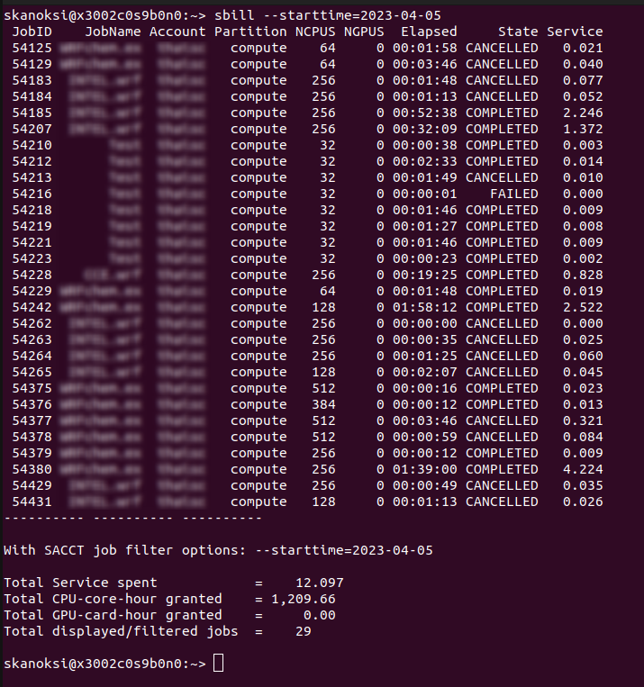

# SBILL-SLURM
Query SLURM billing per job through SLURM sacct command

SBILL version:
1.5.0-RC3 (10 January 2025)

Dependencies:
+ python (>=3.1.0)  -- subprocess, math, os, sys, str.format
+ numpy  (>=1.11.0) -- Optional, only for --histogram option
+ SLURM

-----
```txt
Usage: sbill [OPTIONS(0)...]

Query job billing and information

JOB FILTER/QUERY OPTIONS:
  -j, --jobs=<jobid,...>            jobs in the specified list
      --name=<jobname,...>          jobs that have these name(s)

  -A, --accounts=<account,...>      jobs charged to these account(s)
                                      Default: all of yours
  -a, --allusers                    jobs submitted by any users
  -u, --user=<username,...>         jobs submitted by these user(s)
                                      Default: only you

  -L, --allclusters                 jobs on any clusters
  -p, --partition=<partition,...>   jobs on these partition(s)
  -w, --nodelist=<nodename,...>     jobs on these node(s)

  -N, --nnodes=<num> or <min-max>   jobs that use the specified number of nodes
  -C, --ncpus=<num> or <min-max>    jobs that use the specified number of CPUs
  -G, --ngpus=<num> or <min-max>    jobs that use the specified number of GPUs

      --state=<job_state,...>       jobs that are marked with these state(s)
      --runtime=<min[-max:unit]>    jobs that have runtime within the range,
                                    where unit is 'sec', 'min', or 'hr'
      --range=<min[-max]>           jobs charged within the specified SHr range

  -E, --endtime=<time>              jobs that start before this time point
  -S, --starttime=<time>            jobs that end after this time point
                                      Default: Today at 00:00:00
  -T, --trim, --truncate (slurm)    trim job runtime by trunicating start/end time
                                    according to -S, -E options
  Note: time format is...                      
             YYYY-MM-DD[THH:MM[:SS]] or              
             MM/DD[/YY]-HH:MM[:SS] or                
             MMDD[YY] or MM/DD[/YY] or MM.DD[.YY] or 
             now[{+|-}count[seconds(default)|minutes|hours|days|weeks]]
  Warning: -T MUST be used for correctness when doing a net utilization report

JOB DISPLAY/OUTPUT OPTIONS:
  -l, --long                        display the jobs in SBILL long format
  -o, --format=<field,...>          list of fields to be displayed where... 
                                     = Column width can be fixed by using
                                       <field>%<width>
                                     = User's default format can be set by
                                       export SBILL_FORMAT=xxx
                                     = The 'Default' field is an alias
                                       of SBILL default field list, try
                                       -o default,start,end
      --helpformat                  display all available fields, then exit

  -H, --histogram=<nbin>[:field]    display text-based histogram of the jobs
                                    where field is SHr, SHrPerHour,
                                                   NNode, NCPU, NGPU,
                                                   CPU-core-hour, GPU-card-hour,
                                                   RunSec, RunMin or RunHour

  -X, --summary                     display only the summary report
      --sum-by-account              display sum(s) of the filtered jobs by account
      --sum-by-user                 display sum(s) of the filtered jobs by user
      --sumby[xxx]                  various aliases of --sum-by-xxx

      --noconvert                   display without converting unit (KMGTP)
      --units=[KMGTP]               display values in the specified unit type
                                    (override --noconvert)

      --to_csv=<filename>           save job records in CSV format to <filename>
      --csv_sep=<character>         separator/delimiter for --to_csv option

OTHERS:
  -h, --help                        print this help message, then exit
  -V, --version                     print SBILL version and few details, then exit

```

| Example:|
| :-----------------: |
|  |
